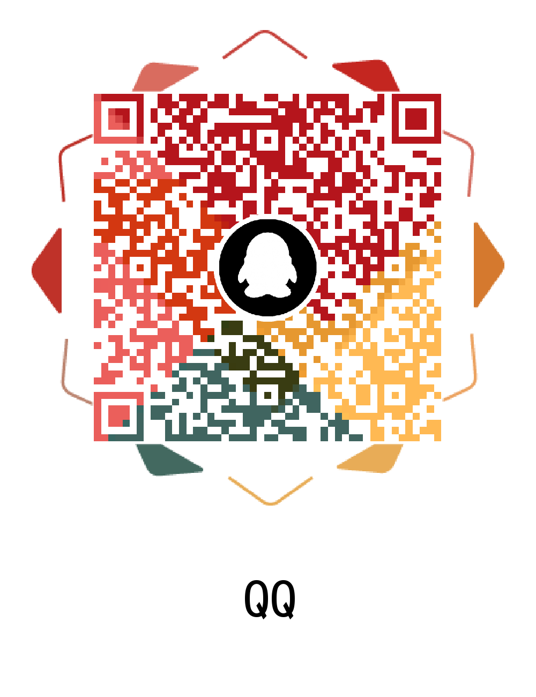
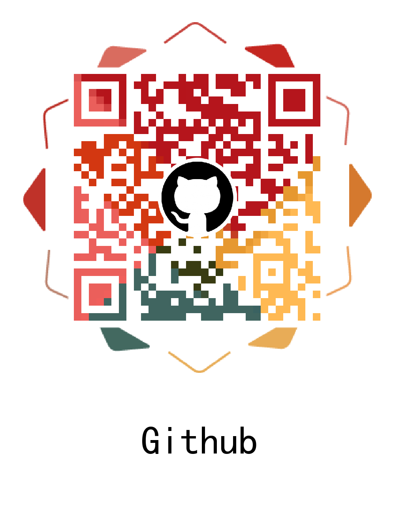

# UIView+UIAppearance

[](https://github.com/Modool)
[](https://developer.apple.com/Objective-C)
[](https://developer.apple.com/iphone/index.action)
[](https://github.com/Modool)
[](http://wpa.qq.com/msgrd?v=3&uin=662988771&site=qq&menu=yes)

## Introduction

- This framework base on <a href="https://github.com/Modool/UIView-UIAppearance-Private"> UIView+UIAppearance+Private </a>.
- It's dedicated to implementing multi-theme solutions with the implementation of the system.
- The system solution is flawed, which can't synchronous theme for these views is being displayed.
- It's an extension for UIAppearance protocol.

## How To Get Started

* Download `UIView+UIAppearance` and try run example app

## Installation


* Installation with CocoaPods

```
source 'https://github.com/Modool/cocoapods-specs.git'
platform :ios, '8.0'

target 'TargetName' do
pod 'UIView+UIAppearance', '~> 1.0'
end
```

* Installation with Carthage

```
github "Modool/UIView-UIAppearance" ~> 1.0
```

* Manual Import

```
drag “UIView+UIAppearance” directory into your project

```

## Requirements
- Requires ARC

## Architecture
### UIView (UIAppearance)
* `hook methods`
	* `allocWithZone:` 
	* `appearance`

### UIAppearanceHooker
* `properties`
	* `appearance` storage of current instance of _UIAppearance
	* `appearanceViewClass` storage of current view class
	* `appearanceInvocations` storage of invocations of appearance properties of view class 
	* `mutableInstances` storage of instances of view class 
* `methods`
	* `methodForSelector:`  transmition of method implementation
	* `forwardInvocation:` 	transmition of invocation
	* `forwardingTargetForSelector:` transmition of forwarding target
	* `methodSignatureForSelector:` transmition of method signature
	* `respondsToSelector:` 

## Usage

* Demo FYI 

## License
`UIView+UIAppearance` is released under the MIT license. See LICENSE for details.

## Communication


